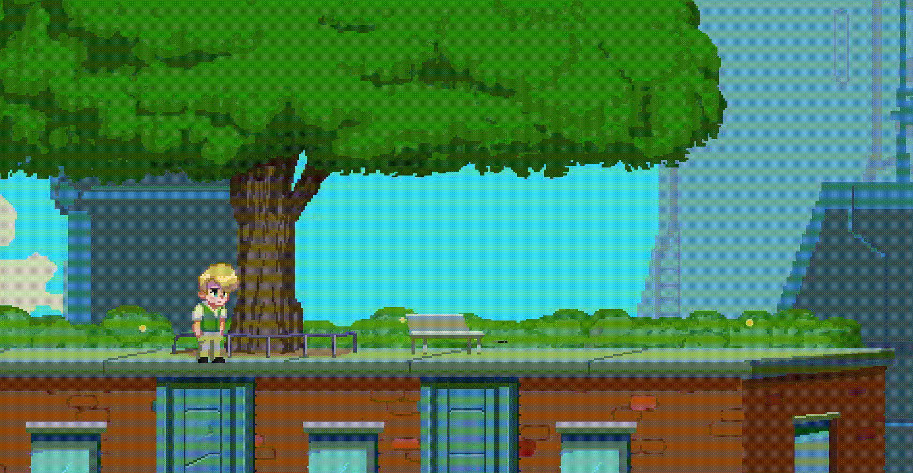
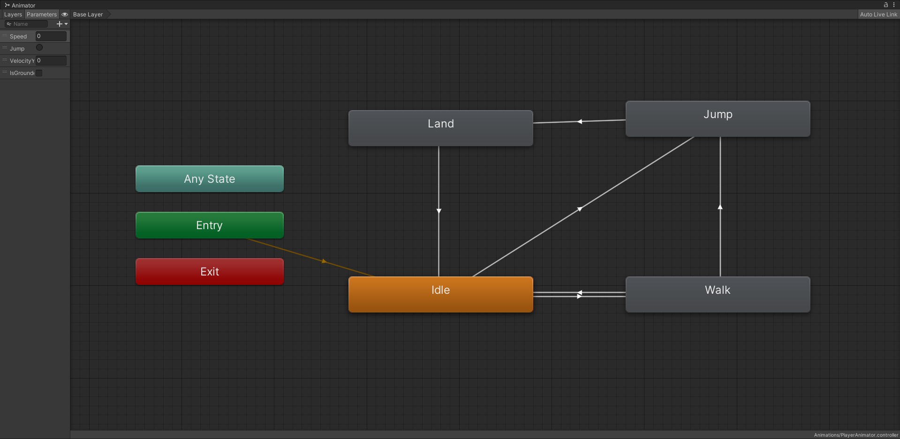

# Playstorm Super Platformer

Esto es un platformer 2D hecho en Unity por **[Playstorm Studios](https://playstormstudios.com/)** para el curso de **Unity for Dummies**.



## Scripts

Este es un ejemplo de como hacer un script en **C#** para **Unity**. Todos los scripts del proyecto están en la carpeta [Scripts](./Assets/Scripts/).

```csharp
public class MyScript : MonoBehaviour
{
    // Se ejecuta una vez al inicio
    void Start()
    {
        Debug.Log("Hello World!");
    }

    // Se ejecuta una vez por frame
    void Update()
    {
        Debug.Log("Hello World!");
    }
}
```

## Animaciones

Las animaciones se están guardadas en la carpeta de [Animations](./Assets/Animations/). Y sus *sprites* se encuentran en la carpeta [Sprites](./Assets/Sprites/).



## Escenas

Los niveles, menús y elementos que forman el juego se organizan en escenas. Están en [Scenes](./Assets/Scenes/).
